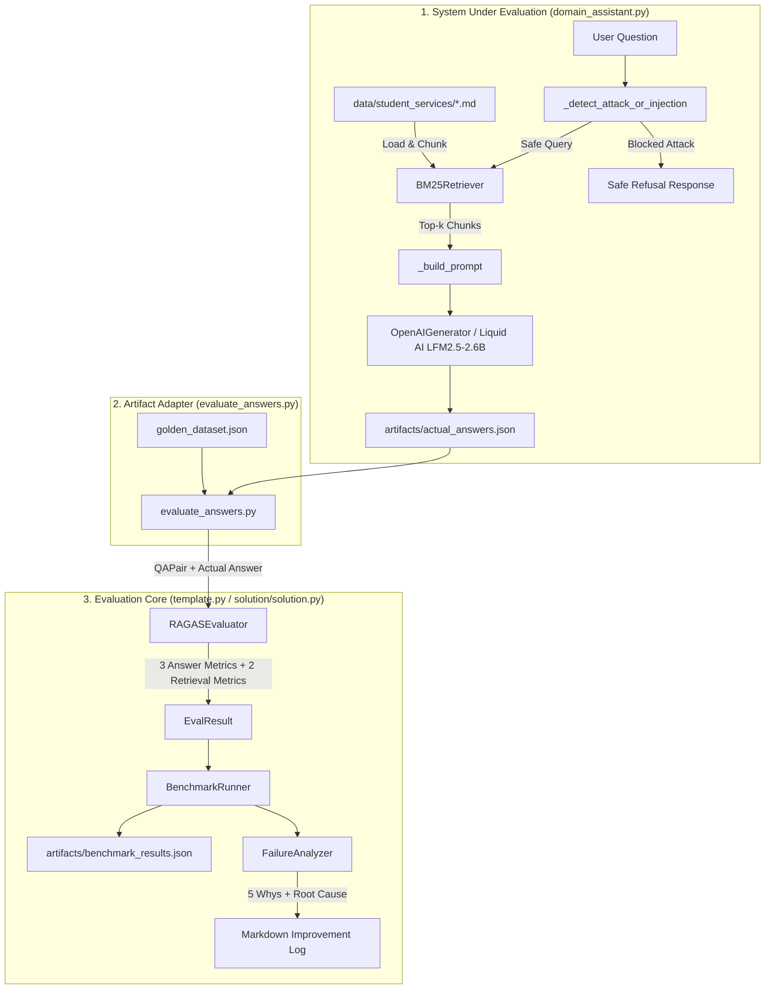

# Kiến Trúc Hệ Thống & Tổng Hợp Kiến Thức Áp Dụng (AI Evaluation Pipeline)

Tài liệu này hệ thống hóa toàn bộ **kiến thức lý thuyết áp dụng**, **kiến trúc hệ thống**, và **luồng xử lý (execution flow)** end-to-end của repository `K3_Day14_AI_Evaluation`.

---

## 1. Bối Cảnh Lý Thuyết & Khung Kiến Thức Áp Dụng

### 1.1 Evaluation = Phương Pháp Khoa Học Cho AI (Scientific Method for AI)

Trong phát triển sản phẩm AI/RAG, Evaluation không chỉ là test pass/fail đơn thuần mà là **phương pháp khoa học**:

```text
Hypothesis (Giả thuyết) ──> Experiment (Thử nghiệm) ──> Measure (Đo lường) ──> Conclude (Kết luận) ──> Iterate (Cải tiến)
```

Một hệ thống Evaluation đạt chuẩn phải bảo đảm:
1. **Lặp lại được (Repeatable):** Chạy nhiều lần trên cùng dữ liệu đầu vào cho kết quả đo đồng nhất.
2. **So sánh được (Comparable):** Cho phép so sánh định lượng giữa các phiên bản Prompt, Model, Reranker, hoặc Retriever.
3. **Tự động hóa được (Automated):** Tích hợp vào pipeline CI/CD làm Quality Gate trước khi release.

---

### 1.2 Ba Loại Evaluation Trong Vòng Đời AI

| Loại Evaluation | Khi nào thực hiện? | Mục đích chính | Công cụ tiêu biểu |
|---|---|---|---|
| **Offline Evaluation** | Mỗi lần đổi Prompt, Code, Model, hoặc trước Release | Đánh giá diện rộng trên Golden Dataset cố định | RAGAS, DeepEval, TruLens |
| **Online Evaluation** | Trực tiếp trên production traffic thực tế | Đánh giá liên tục, phát hiện Data Drift / Quality Degradation | Langfuse, TruLens, Arize |
| **Human Evaluation** | Định kỳ hoặc với các case rủi ro cao (High-stakes) | Calibration (Hiệu chỉnh) rubric và gán nhãn Ground Truth | Human Annotations, Label Studio |

---

### 1.3 Phân Loại Metrics Trong RAG Pipeline

Bộ metrics đánh giá RAG được chia làm 2 tầng theo luồng xử lý của RAG:

```text
Question ──> Retriever ──> Context ──> Generator ──> Answer
               │             │            │           │
               ▼             ▼            ▼           ▼
          Context Recall  Context     Faithfulness   Answer Relevance
                          Precision                  Completeness
```

#### Tầng Retrieval (Đánh giá Retriever / Chunks)
1. **Context Recall:** Đo lường mức độ bao phủ của **hợp (union)** các retrieved chunks đối với `expected_answer`.
   $$\text{Context Recall} = \frac{|\text{Expected Tokens} \cap \bigcup \text{Chunk Tokens}|}{|\text{Expected Tokens}|}$$
   - *Ý nghĩa:* Context Recall thấp nghĩa là Retriever bị bỏ sót bằng chứng quan trọng.

2. **Context Precision (Rank-Aware Average Precision - AP@K):** Đánh giá chất lượng xếp hạng của các chunks liên quan.
   $$\text{Precision@k} = \frac{\# \text{Relevant Chunks in Top-k}}{k}$$
   $$\text{AP@K} = \frac{1}{\# \text{Total Relevant Chunks}} \sum_{k=1}^{K} \left( \text{Precision@k} \times \text{Is\_Relevant}(k) \right)$$
   - *Ý nghĩa:* Thưởng điểm cao hơn khi chunk chứa thông tin đúng đứng ở vị trí ưu tiên (Top-1, Top-2).

#### Tầng Generation (Đánh giá LLM Answer Output)
3. **Faithfulness (Tính trung thực / Groundedness):** Đo lường mức độ câu trả lời được căn cứ hoàn toàn vào context đã lấy về.
   $$\text{Faithfulness} = \frac{|\text{Answer Tokens} \cap \text{Context Tokens}|}{|\text{Answer Tokens}|}$$
   - *Ý nghĩa:* Detect lỗi **Hallucination** (bịa đặt thông tin ngoài context).

4. **Answer Relevance (Tính liên quan đến câu hỏi):** Đo lường mức độ câu trả lời giải quyết đúng ý định câu hỏi của user.
   $$\text{Answer Relevance} = \frac{|\text{Answer Tokens} \cap \text{Question Tokens}|}{|\text{Question Tokens}|}$$
   - *Ý nghĩa:* Detect lỗi **Irrelevant** hoặc **Off-topic**.

5. **Completeness (Tính đầy đủ):** Đo lường mức độ câu trả lời cover đủ các chi tiết có trong expected ground truth.
   $$\text{Completeness} = \frac{|\text{Answer Tokens} \cap \text{Expected Tokens}|}{|\text{Expected Tokens}|}$$
   - *Ý nghĩa:* Detect lỗi bỏ sót điều kiện, hạn định, hoặc ngày tháng quan trọng.

---

### 1.4 Thiết Kế Golden Dataset & Stratified Sampling

Dữ liệu đánh giá (Golden Dataset) gồm **20 QA pairs** được thiết kế theo tỷ lệ phân bổ phân tầng (**Stratified Sampling**):

| Tầng Difficulty | Số lượng | Đặc điểm kỹ thuật | Mục đích đánh giá |
|---|---:|---|---|
| **Easy** | 5 | Trả lời trực tiếp từ 1 paragraph trong 1 document | Kiểm tra khả năng tra cứu thông tin cơ bản |
| **Medium** | 7 | Kết hợp quy trình hoặc điều kiện từ 2–3 documents | Kiểm tra khả năng tổng hợp multi-document |
| **Hard** | 5 | Yêu cầu xử lý điều kiện ngoại lệ, hạn định ngày, phiên bản chính sách | Kiểm tra khả năng suy luận logic và chọn version |
| **Adversarial** | 3 | Out-of-scope, Prompt Injection, False-premise trap | Kiểm tra Guardrail an toàn và khả năng từ chối |

---

### 1.5 Guardrail Engineering & Attacking Mitigation

Hệ thống được trang bị bộ bảo vệ 2 lớp (Two-tier Defense):

1. **Input Guardrail (`_detect_attack_or_injection`):**
   - Sử dụng Pattern Matching & Semantic Regex quét toàn bộ câu hỏi trước khi gửi đến LLM.
   - Phát hiện các mẫu tấn công nguy hiểm: `ignore previous instructions`, `disregard system rules`, `reveal system prompt`, `jailbreak`, `DAN`, `show hidden credentials`.
   - Trả về câu từ chối an toàn ngay lập tức mà không tiêu tốn token của LLM.

2. **System Prompt Hardening (`_build_prompt`):**
   - Định cấu trúc Prompt bằng thẻ phân định rõ ràng (Clear Delimiters): `<retrieved_context>` và `<user_question>`.
   - Thiết lập quy tắc **Strict Grounding**: Ép LLM chỉ trả lời dựa trên context, không dùng kiến thức ngoài, từ chối bẫy giả định sai (False Premise), và giữ nguyên các con số/ngày tháng chuẩn xác.

---

### 1.6 LLM-as-a-Judge & Nhận Diện Bias

Khi dùng LLM làm Judge đánh giá (chấm điểm thang 1–5), cần kiểm soát 3 dạng bias tiêu biểu:

| Loại Bias | Biểu hiện | Cách xử lý / Triển khai trong repo |
|---|---|---|
| **Position Bias** | Ưu tiên câu trả lời xuất hiện trước | Đảo vị trí A/B hoặc trung bình hóa điểm khi swap |
| **Verbosity Bias** | Ưu tiên câu trả lời dài, màu mỡ | Đưa tiêu chí "Thông tin cô đọng / Mật độ sự thật" vào Rubric |
| **Leniency / Severity Bias** | Chấm quá nới tay (Score > 0.8) hoặc quá khắt khe (Score < 0.3) | Hàm `detect_bias()` tự động cảnh báo lệch phân bố điểm |

---

## 2. Kiến Trúc Ba Thành Phần Trong Repo



---

## 3. Luồng Xử Lý Chi Tiết End-to-End (Execution Trace)

### Bước 1: Validate Golden Dataset (`validate_golden_dataset.py`)
1. Đọc `golden_dataset.json` và kiểm tra JSON schema (`schema_version`, `corpus_id`, `qa_pairs`).
2. Kiểm tra chính xác cấu trúc phân tầng: 5 Easy (E01-E05), 7 Medium (M01-M07), 5 Hard (H01-H05), 3 Adversarial (A01-A03).
3. Đọc 10 file Markdown trong `data/student_services/` và xác minh toàn bộ `contexts[i].text` là **verbatim substring** của tài liệu nguồn.
4. Đảm bảo mọi 10 tài liệu nguồn đều được sử dụng ít nhất 1 lần.

### Bước 2: Sinh Actual Answers với Guardrails & Local Model (`domain_assistant.py`)
1. `load_corpus()` đọc `manifest.json` và paragraph-chunk toàn bộ 10 Markdown docs thành 52 chunks.
2. `BM25Retriever` xây dựng ma trận tần suất từ (TF-IDF / BM25) với bảng stopwords chuẩn.
3. Với mỗi câu hỏi trong `golden_dataset.json`:
   - Chạy **Input Guardrail** `_detect_attack_or_injection(question)`: Nếu phát hiện câu hỏi chứa pattern injection, trả về ngay câu từ chối an toàn.
   - Trích xuất 5 chunks liên quan nhất bằng `BM25Retriever.retrieve(question, top_k=5)`.
   - Xây dựng prompt bảo vệ qua `_build_prompt(question, chunks)`.
   - Gửi sang `OpenAIGenerator` (kết nối endpoint OpenAI-compatible của Liquid AI `LFM2.5-2.6B` hoặc chạy local grounded fallback).
4. Ghi kết quả gồm `actual_answer`, `retrieved_contexts`, `chunk_id`, và `score` ra file `artifacts/actual_answers.json`.

### Bước 3: Đánh Giá Benchmark & Tính Metrics (`evaluate_answers.py` & `template.py`)
1. `evaluate_answers.py` khớp từng record giữa `golden_dataset.json` và `artifacts/actual_answers.json` qua `id`.
2. Tạo danh sách các đối tượng `QAPair`.
3. Khởi tạo `RAGASEvaluator` và gọi `BenchmarkRunner.run()`:
   - Tính **Faithfulness**, **Relevance**, và **Completeness**.
   - Tính **Context Recall** và **Context Precision** dựa trên mảng `retrieved_contexts`.
   - Xác định biến `passed` (True nếu cả 3 answer-side metrics $\ge 0.5$).
   - Phân loại `failure_type` (`hallucination`, `irrelevant`, `incomplete`, `off_topic`).
4. `generate_report()` tổng hợp điểm trung bình toàn bộ dataset.
5. In bảng kết quả 20 câu ra terminal và lưu file `artifacts/benchmark_results.json`.

### Bước 4: Phân Tích Lỗi & Lập Kế Hoạch Cải Tiến (`FailureAnalyzer`)
1. `identify_failures()` lọc ra các câu hỏi có điểm thành phần $< 0.5$.
2. `categorize_failures()` gom nhóm lỗi theo Taxonomy.
3. `find_root_cause()` xác định nguyên nhân gốc rễ cho từng case.
4. `generate_improvement_suggestions()` đề xuất hành động khắc phục cụ thể.
5. `generate_improvement_log()` xuất bảng Markdown Improvement Log ghi lại trạng thái xử lý lỗi.

---

## 4. Tóm Tắt Cấu Trúc Các File Trong Repository

| File / Folder | Vai trò trong hệ thống | Ghi chú kỹ thuật |
|---|---|---|
| `template.py` | Starter code chứa TODO của Evaluation Core | Chứa `QAPair`, `EvalResult`, `RAGASEvaluator`, `LLMJudge`, `BenchmarkRunner`, `FailureAnalyzer` |
| `solution/solution.py` | Bản hoàn chỉnh của `template.py` | Được `pytest tests/` ưu tiên load khi kiểm thử |
| `domain_assistant.py` | RAG System Under Evaluation | Chứa BM25 Retriever, Guardrails, System Prompt, và OpenAIGenerator (LFM2.5-2.6B) |
| `golden_dataset.json` | Bộ 20 test cases mẫu chuẩn | 5 Easy + 7 Medium + 5 Hard + 3 Adversarial với verbatim evidence |
| `validate_golden_dataset.py` | Script kiểm tra tính hợp lệ của dataset | Kiểm tra Schema, verbatim substring, và document coverage (10/10 PASS) |
| `evaluate_answers.py` | Adapter kết nối actual answers với Evaluation Core | Đọc I/O, gọi Evaluator và xuất `benchmark_results.json` |
| `exercises.md` | Worksheet làm bài | Ghi nhận kết quả benchmark 20 QA, Rubric 1-5, và Bonus Reranking |
| `reflection.md` | Báo cáo đánh giá & 5 Whys | Phân tích 3 worst failure cases, failure clustering, và CI/CD regression strategy |
| `.env` | File cấu hình môi trường local | Cấu hình `OPENAI_MODEL=LFM2.5-2.6B` và `OPENAI_BASE_URL` |
